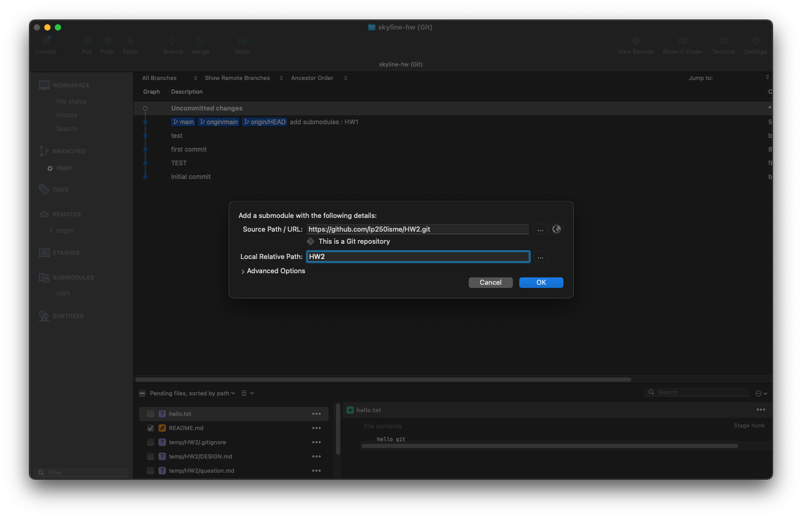
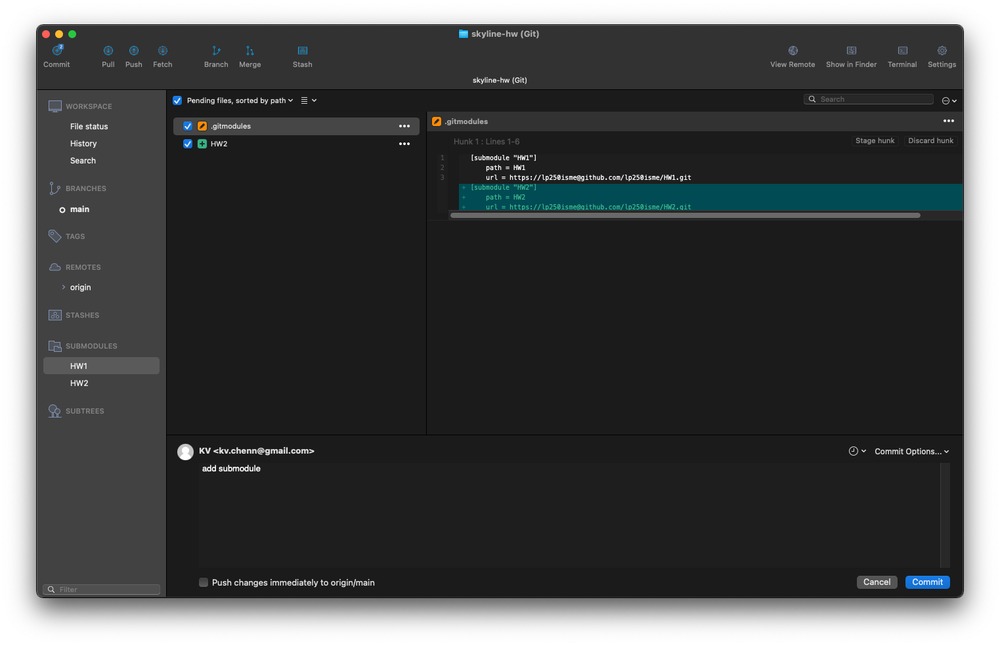
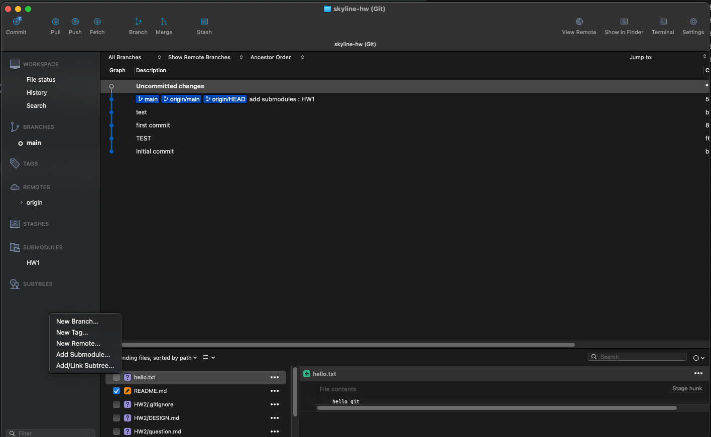

# HW1

## 請說明什麼是 git Sub-module , 使用時機與實際演練該如何使用

### 使用時機

當該專案需要依賴到其他專案時，為了避免將重複的模組都塞進主要專案，可將其以 submodule 形式包含在專案中。

### 實際演練該如何使用

以 SourceTree 做練習

1. 於主要專案左側點擊右鍵並選擇 Add Submodule...

   

2. 輸入 Git URL 以及 本機位置

   

3. 動作會產生一次 commit ，commit 後 push 即可

   
